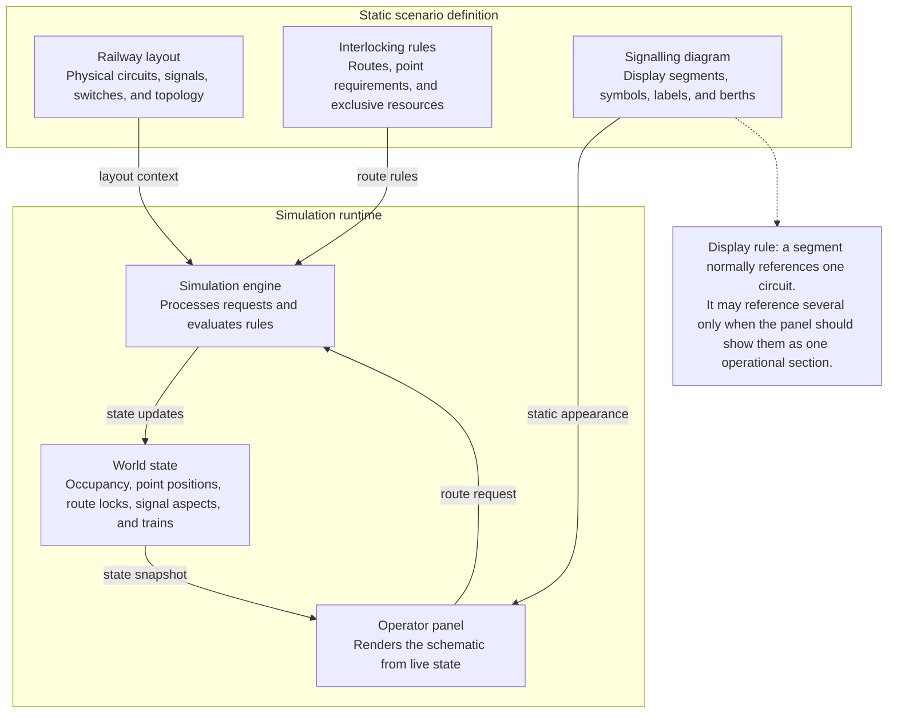

# OpenRCS signalling diagram architecture

The signalling diagram is static scenario data. The operator panel derives colours and labels from `WorldState`; it does not make route or safety decisions.
